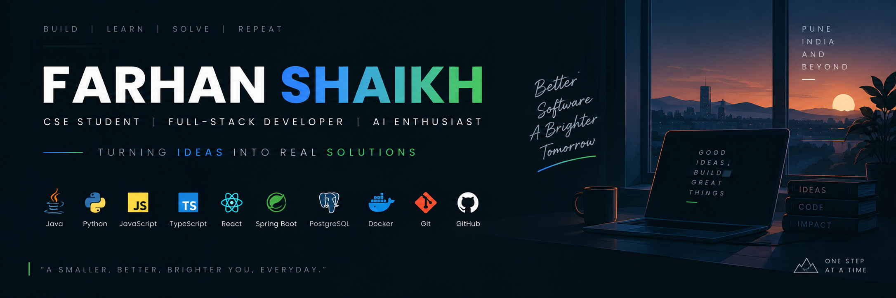

  

<h1 align="center">Hey, I'm Farhan Shaikh 👋</h1>

  <b>CSE Student • Full-Stack Developer • AI & Backend Enthusiast</b>

  Building practical software systems with AI, backend engineering and modern web technologies.

  
  

---

## 👨‍💻 About Me

I'm a **Computer Science Engineering student at Vishwakarma University, Pune**, passionate about building software that solves real-world problems.

My main interests are:

- 🤖 Artificial Intelligence & LLM applications
- ⚙️ Backend Engineering & REST APIs
- 🌐 Full-Stack Web Development
- 🗄️ Database Design & Architecture
- ☁️ Cloud & Deployment
- 🔐 Authentication & Application Security
- 🚀 Hackathons & Product Development

I enjoy taking an idea from **concept → architecture → implementation → working prototype**.

---

## 🚀 What I'm Building

### 🏥 MediKiosk — The Synergist

AI-powered Ayurveda clinical history-taking platform.

**Focus:** Adaptive questioning • Multilingual interaction • Voice-to-Voice • Offline-first • Privacy

**Tech:** React • TypeScript • Python • AI
---

---

### 🩺 Report RX

AI-assisted medical report analysis platform.

**Focus:** OCR • Medical Data Processing • Structured JSON • AI Explanation

**Tech:** Python • FastAPI • PostgreSQL • OCR • LLMs
---

## 🧠 Tech Stack

### Languages

### Backend

### Frontend

### Database & Tools

---

## 📚 Currently Learning

- Advanced Java & Spring Boot
- System Design
- REST API Architecture
- AI / LLM Integration
- Cloud & DevOps
- Cybersecurity
- Scalable Software Systems

---

## 🎯 2026 Goals

- Build production-quality full-stack applications
- Strengthen backend and system-design skills
- Build more AI-powered products
- Deploy applications to the cloud
- Contribute to open-source projects
- Participate in hackathons
- Improve DSA and problem-solving

---

## 📊 GitHub Activity

  
  

  

---

## 🤝 Let's Connect

I'm interested in:

**AI • Backend Development • Full-Stack • Open Source • Hackathons • Startups**

### Build. Learn. Ship. Repeat.

